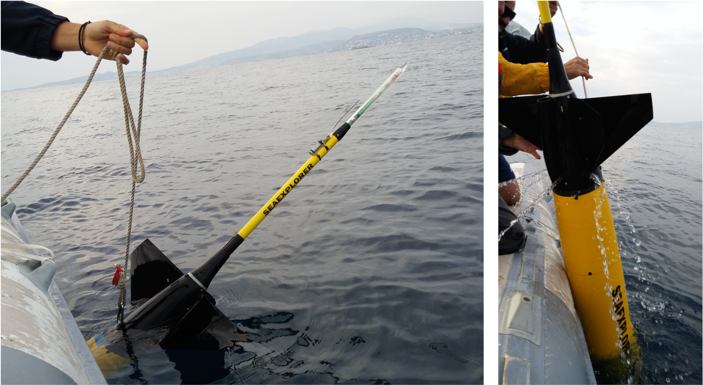

(mission-exe)=
# Missions execution

This section covers the activities of those deploying and recovering the gliders in the field in addition to best practices for glider pilots. 

(deploy)=
## Deployment
The deployment procedure of gliders is platform specific and the manufacturer guidelines should be followed. 
Commonly, gliders are deployed from large ships or small boats. 
Recently, gliders have been deployed from an AutoNaut (UEA). 
If sensor caps are required, these should be removed before the glider enters the water. 

:::{figure-md} glider-deployment

 Deployment of Seaglider using a winch (S.A Agulhas II). (Figure credit: Isabelle Giddy)
:::

Gliders' recovery is often performed by a small boat, while the manufacturer's guidelines should be followed during the procedure.

:::{figure-md} glider-recovery

Recovery of the glider from a small boat. (Figure credit: Evi Bourma)
:::

(sensor-comparison)=
### Colocated CTD profiles for post-mission sensor correction
On deployment and recovery of the glider, an in situ comparison-CTD cast should be completed. 
On a ship, the CTD rosette is often accompanied by salinometry that is used to calibrate the ship CTD (ref). 
If the glider is deployed from a small boat, a smaller hand deployable CTD can be used.
In the case that a CTD cast cannot be completed at the same time as deployment/recovery, the characteristics of deep water masses (below the thermocline and depending on the region of deployment) can be compared with high quality reference CTD profiles (shipborne CTD, mooring data or delayed-mode Argo float data). 
Those reference data should preferentially sample the same regional basin and be affected by the same local circulation pattern.
Ideally, offshore deep profiles sampling water mass with low variability in their properties should be used.

(piloting)=
## Piloting
In this section specific piloting requirements during the mission execution are mentioned which are needed to allow quality control. 

(flight-model)=
### Flight model calibration dives
Upon deployment it is important to perform a number of calibration dives (follow steps outlined Depth Averaged Currents (DAC) SOP to constrain the flight model) in order to be used for the correction of salinity in the field {numref}`sensor-calib`.

(sensor-correction)=
### Data to correct for sensor drift and offset
Corresponding with {numref}`sensor-comparison`, the glider should complete a dive at the beginning and end of deployment in parallel with an independent CTD cast.  
Coordination between the recovery group and the pilots is essential. 
In the case where this is not possible, the deep water (from 600-1000 m) measurement from the nearest CTD in space (not time) can also be used as deep water masses tend to be relatively invariant at longer timescales (weeks-months). 
Further comparison can be made in the case of multiple gliders being deployed in parallel, these can be piloted such that they cross paths every intermittently for inter-comparison.

(sensor-response)=
### Gather data to help correct for sensor response time 
Regular up- and down casts are needed to estimate and correct for the sensor response time. 
Combined up- and downcasts should be carried out at least every week and particularly at the beginning and at the end of the deployment. 
One to two days per week appear to be a reasonable compromise between energy saving and calibration quality. 
If bio-fouling is expected during the deployment it is better to collect up-down pairs earlier rather than later.
